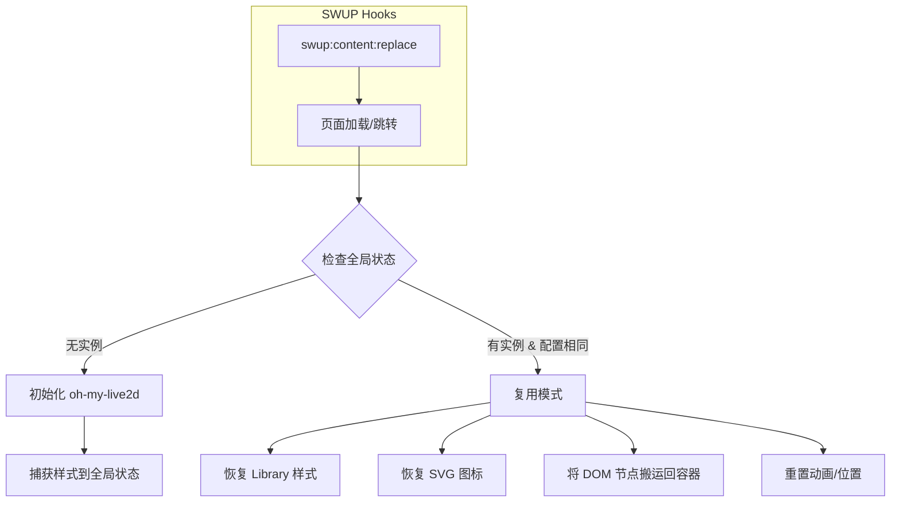

# Live2D 看板娘持久化实现方案文档

## 1. 背景与挑战

在 Astro + SWUP 的架构下，网站实现了类似 SPA（单页应用）的无刷新跳转体验。然而，这种机制对第三方库（如 `oh-my-live2d`）带来了严峻挑战：

1.  **DOM 销毁**：SWUP 会替换 `<body>` 内容，导致挂载在 body 中的 Live2D 元素被移除。
2.  **样式丢失**：SWUP 会替换 `<head>` 内容，导致库动态注入的 `<style>` 标签丢失，引起图标变大、布局错乱。
3.  **状态重置**：每次页面跳转，组件脚本重新执行，默认行为是销毁旧实例并重新加载模型（导致模型消失再滑入）。

## 2. 核心架构：全局单例 + 样式守护

为了解决上述问题，我们实现了一套**“全生命周期托管”**方案。

### 2.1 全局状态管理 (Global State)

利用 `window` 对象存储全局状态，绕过 Astro 组件的生命周期限制。

```typescript
const GLOBAL_STATE_KEY = "__mizukiLive2D__";
// 存储实例、配置签名、样式快照、DOM 节点引用
window[GLOBAL_STATE_KEY] = {
  instance: null,        // Live2D 实例
  libraryStyles: [],     // 捕获的库样式
  rootElement: null,     // 持久化 DOM 容器
  // ...
};
```

### 2.2 DOM 持久化 (DOM Persistence)

我们创建了一个脱离于 SWUP 替换区域之外的容器 `#live2d-persistent-root`，直接挂载到 `body` 的末尾（通常 SWUP 只替换 main 容器，或者我们需要手动维护这个根节点）。

*   **策略**：在初始化时，检查是否存在该容器。如果不存在则创建。
*   **搬运**：每次页面跳转后，检查 Live2D 的 Canvas 和 UI 元素是否还在 DOM 中。如果被 SWUP 移除，则从内存（全局状态）中找回这些节点，并重新 `appendChild` 到持久化容器中。

### 2.3 样式快照与回放 (Style Snapshot & Replay)

这是解决“菜单消失”、“图标变大”问题的关键。

1.  **捕获 (Capture)**：
    *   在首次加载成功后，扫描 `<head>` 中所有包含 `.oml2d-` 选择器的 `<style>` 标签。
    *   将这些 CSS 文本内容保存到 `globalState.libraryStyles`。
    *   *优化*：排除过大的样式块（防止误伤全局 CSS）和我们自己注入的样式。

2.  **恢复 (Restore)**：
    *   在 SWUP 完成页面替换（`content:replace`）后。
    *   遍历保存的样式内容，创建新的 `<style>` 标签并注入到新的 `<head>` 中。

3.  **强制补丁 (Manual Patch)**：
    *   `ensureStylesInjected()`：注入带有 `!important` 的关键 CSS，确保即使库样式加载延迟，图标大小和菜单可见性也能得到基本保证。
    *   `ensureIconsInjected()`：检查 SVG Sprite 是否存在（通常被 SWUP 移除），如果缺失则重新注入 SVG 定义字符串。

### 2.4 智能复用逻辑 (Smart Reuse)

在 `initLive2D` 主函数中：

1.  **比对配置**：计算配置对象的签名（Signature）。
2.  **决策**：
    *   如果 `全局实例存在` 且 `配置未变` -> **进入复用模式**。
    *   否则 -> **销毁旧实例，新建实例**。
3.  **复用模式执行的操作**：
    *   调用 `restoreLibraryStyles()` 恢复样式。
    *   调用 `ensureIconsInjected()` 恢复图标。
    *   将 Canvas 和 UI 元素搬运回 DOM。
    *   重置动画状态（去除 `slideIn` 动画，保持模型静止）。
    *   重新绑定事件监听器。

## 3. 关键代码流程图



## 4. 维护指南

如果未来遇到样式问题：
1.  检查 `captureLibraryStyles` 是否捕获到了新的样式类名。
2.  在 `ensureStylesInjected` 中添加新的 `!important` 规则作为兜底。

如果遇到模型不显示：
1.  检查控制台日志 `Live2D: Checking reuse`，确认 `hasInstance` 为 true。
2.  检查 `#live2d-persistent-root` 是否存在于 DOM 中且包含 Canvas 元素。
